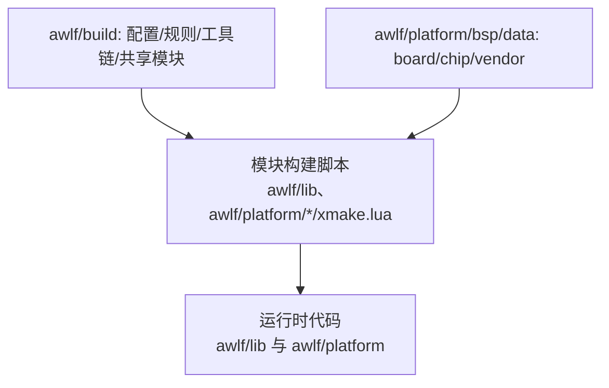
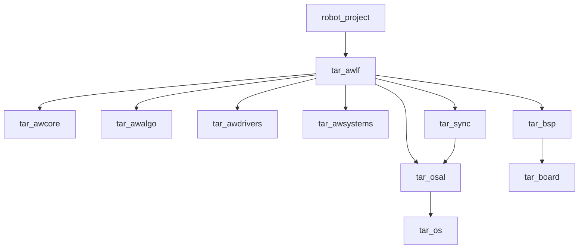
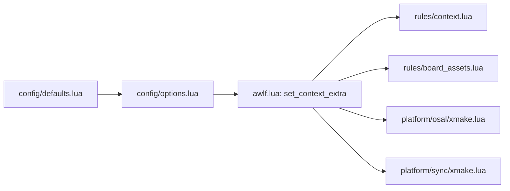
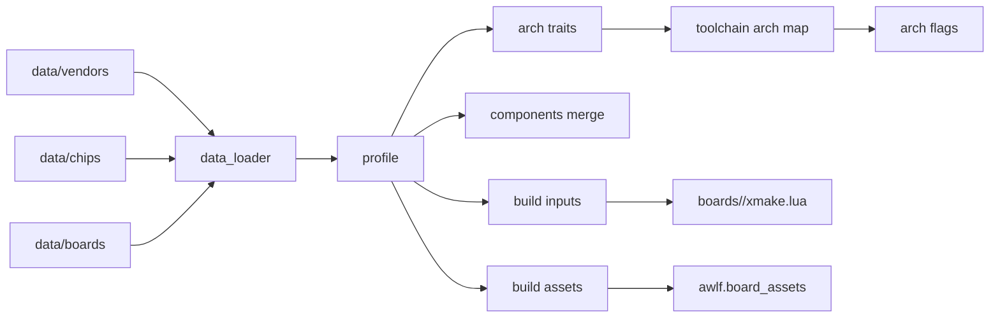

# AWLF XMake 维护者手册

## 1. 目标与维护边界
本手册面向维护者，目标是说明 AWLF 构建体系的模块边界、依赖关系、数据流与扩展方式。文档内容完全基于当前仓库实现。

相关文档索引：
- `awlf/document/build/BuildTasksManual.md`：内置任务与参数说明。
- `awlf/document/build/BuildSystemBestPractices.md`：构建系统最佳工程实践。

## 2. 构建系统设计方法论
- **分层原则**：构建系统只在 `awlf/build/` 集中管理“选项、规则、工具链、共享模块”，模块级构建脚本就地维护，避免全局脚本侵入模块。
- **单一入口**：顶层 `xmake.lua` 仅负责入口转发与目标聚合，不直接承载工具链或板级逻辑。
- **数据/行为分离**：板级/芯片/厂商数据放在 `awlf/platform/bsp/data`，构建规则与工具链行为放在 `awlf/build`。
- **依赖方向**：模块构建脚本可以调用构建层 API（如 `awlf`、`bsp`），构建层不得硬编码模块路径或板级细节。
- **上移准则**：当逻辑被多个模块复用、与具体板级无关、且不依赖运行时代码时，才上移到 `awlf/build`；否则保持模块内聚。
- **脚本域约束**：仅在脚本域使用 `import/try/raise/task.run` 等 API，描述域只做目标/规则/选项声明，避免配置期卡死或无效调用。

## 3. 构建链路全景（从配置到产物）
1) 配置阶段：`xmake f` 读取 `board/os/toolchain/sync_accel` 等选项。  
2) 选项回调：`awlf/build/config/options.lua` 在 `after_check` 中写入上下文。  
3) 上下文持久化：`awlf/build/modules/awlf.lua` 将关键字段保存到配置缓存。  
4) 编译数据库：通过 `plugin.compile_commands.autoupdate` 在构建后生成 `compile_commands.json` 至项目根目录。  
5) 目标加载：`awlf.context` 注入架构与工具链参数。  
6) 板级资源：`awlf.board_assets` 注入启动文件与链接脚本。  
7) 可选镜像：`awlf.image_convert` 生成 `hex/bin` 并在清理时移除。  
8) 编译与链接：`tar_board`、`tar_os`、`tar_sync` 等目标完成编译，最终由 `robot_project` 输出可执行镜像。  

## 4. 构建入口与目录职责
- `xmake.lua`：顶层入口，定义 `robot_project` 并挂载规则。
- `awlf/xmake.lua`：AWLF 构建入口转发（实际入口在 `awlf/build/xmake.lua`）。
- `awlf/build/xmake.lua`：AWLF 构建入口，加载配置/规则/子模块，并在构建后输出 AWLF 信息。

核心目录职责：
- `awlf/build/config/`：构建选项与默认值。
- `awlf/build/rules/`：规则定义（上下文注入、板级资源、镜像转换）。
- `awlf/build/toolchains/`：工具链数据与脚本逻辑。
- `awlf/build/tasks/`：自定义任务（如 flash 烧录）。
- `awlf/platform/bsp/`：BSP 数据加载、合并、板级构建脚本。
- `awlf/platform/osal/`：OS 抽象层与 OS 端口。
- `awlf/platform/sync/`：同步原语与可选加速后端。
自定义任务：
- `xmake flash`：通过 J-Link Commander 烧录，默认优先使用 HEX，可通过 `--firmware` 指定 ELF/HEX。


## 5. 目录职责与依赖方向简图
**依赖方向原则**
- 构建系统层（`awlf/build`）提供配置、规则、工具链与共享 API，供模块构建脚本调用。
- 模块构建脚本（`awlf/lib`、`awlf/platform` 下的 `xmake.lua`）只描述本模块目标与依赖，不反向依赖构建系统实现细节。
- 板级/芯片/厂商数据（`awlf/platform/bsp/data`）仅被 BSP 装配层读取，不直接参与构建规则。



## 6. 目标依赖关系图


## 7. 模块关系与数据流
### 7.1 配置与上下文流向


### 7.2 BSP 数据装配关系


## 8. 模块职责细节
### 8.1 配置模块
- `awlf/build/config/defaults.lua`：定义 `board/os/sync_accel` 默认值。
- `awlf/build/config/options.lua`：
  - 枚举可选 board/os。
  - 将 board/os/toolchain/arch/flags 写入上下文。
  - 对默认值进行合法性校验。
  - `config.arch` 作为平台架构标识：优先取工具链数据中的 `arch`，缺失时使用板级 CPU 架构。
    - `context.arch` 表示 CPU 架构（来自 BSP 芯片数据），芯片仅提供 `arch_traits`，由工具链映射生成 `arch_flags`。

### 8.2 规则模块
- `awlf.context`：
  - 注入 `arch_flags` 与 `toolchain_flags`。
  - 配置阶段校验硬浮点支持，并确保工具链已完成检测。
- `awlf.board_assets`：
  - 注入启动文件与链接脚本。
  - 依赖 `toolchain_linker_flag`。
- `awlf.image_convert`：
  - 构建后生成 `hex/bin`。
  - 清理阶段删除生成文件。

### 8.3 工具链模块
- `awlf/build/toolchains/data.lua`：工具链数据（`toolset/image/linker_flag` 等）。
- `awlf/build/toolchains/xmake.lua`：注册 `kind=custom` 工具链。
- `awlf/build/modules/awlf_toolchain_lib.lua`：脚本侧 API，供规则与配置使用。
- `awlf/build/toolchains/toolchain_bootstrap.lua`：在构建前补全工具链配置，保证首轮构建可用。

### 8.4 BSP 模块
- `bsp/data_loader.lua`：加载 board/chip/vendor 数据并生成 profile。
- `bsp/arch.lua`：解析架构与 arch traits。
- `bsp/components.lua`：合并组件数据（board 覆盖优先）。
- `bsp/inputs.lua`：输出 `defines/includedirs/sources/headerfiles/extrafiles`。
- `bsp/assets.lua`：解析启动文件/链接脚本与板级 OS 配置目录。
- rm-c-board 的 armclang scatter 不再将 FreeRTOS 相关对象固定放入 `RW_IRAM2`，避免 CCM/DMA 风险。

## 9. 数据结构与合并策略
### 9.1 Toolchain 数据
- 定义位置：`awlf/build/toolchains/data.lua`。
- 关键字段：`default/toolchains`。
- `toolchains[name]` 包含 `kind/plat/arch/linker_flag/toolset/image`。
- `linker_accepts_arch_flags`：控制是否将工具链映射得到的 arch ldflags 注入链接阶段（armclang 为 `false`）。
- 对 `gnu-rm/armclang`，`sdk/bin` 需由 CLI 或 `toolchain_presets` 提供。

### 9.2 BSP 三层数据
- vendor：`awlf/platform/bsp/data/vendors/<vendor>.lua`
- chip：`awlf/platform/bsp/data/chips/<chip>.lua`
- board：`awlf/platform/bsp/data/boards/<board>.lua`
- chip 使用 `arch_traits` 描述 CPU/FPU/float-abi 等架构数据。

### 9.3 组件合并规则
- 字段统一：`defines/includedirs/sources/headerfiles/extrafiles`。
- 合并优先级：board 覆盖优先，其次 chip，再其次 vendor。
- `component_overrides` 允许对单组件进行白名单覆盖。

## 10. 上下文与持久化
- 上下文字段：`board_name/chip_name/os_name/toolchain_name/arch/arch_flags/toolchain_flags/board_os_config_dir`。
- `awlf/build/modules/awlf.lua` 将上下文保存到 `awlf_ctx_*` 配置项。
- `get_context()` 缺失字段时会提示先执行 `xmake f`。

## 11. 扩展指南（模板）
### 11.1 新增 vendor（示例）
文件：`awlf/platform/bsp/data/vendors/my-vendor.lua`
```lua
local vendor = {
  name = "MY_VENDOR",
  defines = {},
  includedirs = {},
  components = {
    cmsis = {
      includedirs = {"vendor/MY_VENDOR/CMSIS/Include"},
      headerfiles = {"vendor/MY_VENDOR/CMSIS/Include/**.h"},
    },
  },
}
function get()
  return vendor
end
```

### 11.2 新增 chip（示例）
文件：`awlf/platform/bsp/data/chips/my-chip.lua`
```lua
local chip = {
  name = "my-chip",
  vendor = "my-vendor",
  arch = "cortex-m4",
  defines = {"MY_CHIP"},
  components = {
    device = {
      includedirs = {"vendor/MY_VENDOR/CHIP/Include"},
      headerfiles = {"vendor/MY_VENDOR/CHIP/Include/my_chip.h"},
      sources = {"vendor/MY_VENDOR/CHIP/Source/system_my_chip.c"},
    },
  },
  startup = { ["gnu-rm"] = "vendor/MY_VENDOR/CHIP/Source/gcc/startup_my_chip.s" },
  linkerscript = { ["gnu-rm"] = "vendor/MY_VENDOR/CHIP/Source/gcc/my_chip.ld" },
  arch_traits = {
    cpu = "cortex-m4",
    thumb = true,
  },
}
function get()
  return chip
end
```

### 11.3 新增 board（示例）
文件：`awlf/platform/bsp/data/boards/my-board.lua`
```lua
local board = {
  name = "my-board",
  chip = "my-chip",
  vendor = "my-vendor",
  includedirs = {"boards/my-board/include"},
  sources = {"boards/my-board/source/**.c"},
  osal = { freertos = "boards/my-board/osal/freertos" },
  startup = { ["gnu-rm"] = "boards/my-board/startup/gcc/startup_my_chip.s" },
  linkerscript = { ["gnu-rm"] = "boards/my-board/linker/gcc/my_chip.ld" },
  components = {"cmsis", "device"},
  component_overrides = {},
}
function get()
  return board
end
```

### 11.4 新增 board 构建脚本
文件：`awlf/platform/bsp/boards/my-board/xmake.lua`
```lua
target("tar_board")
  set_kind("static")
  add_rules("awlf.context")
  add_deps("tar_awapi_pal", {public = true})
  on_load(function(target)
    local board_root = os.scriptdir()
    local bsp_root = path.join(board_root, "..", "..")
    local awlf_root = path.join(bsp_root, "..", "..")
    local awlf = import("awlf", {rootdir = awlf_root})
    local context = awlf.get_context()
    local bsp = import("bsp", {rootdir = bsp_root})
    local inputs = bsp.get_board_build_inputs(context.board_name)
    target:add("includedirs", inputs.includedirs, {public = false})
    target:add("defines", inputs.defines)
    target:add("files", inputs.sources)
    target:add("headerfiles", inputs.headerfiles)
    target:add("extrafiles", inputs.extrafiles)
  end)
target_end()
```

### 11.5 新增 OS
目录：`awlf/platform/osal/myos/`，编写 `xmake.lua`：
```lua
target("tar_os")
  set_kind("static")
  add_rules("awlf.context")
  add_files("*.c")
target_end()
```
并在 board 数据中增加映射：
```lua
osal = { myos = "boards/my-board/osal/myos" }
```

### 11.6 新增 Sync 加速后端
目录：`awlf/platform/sync/myos/`，编写 `sync_accel.lua`：
```lua
function get_accel_info()
  return {
    include_dirs = {"path/to/include"},
    defines = {"AWLF_SYNC_ACCEL=1", "AWLF_SYNC_ACCEL_COMPLETION=1"},
  }
end
```

### 11.7 新增 Toolchain
在 `awlf/build/toolchains/data.lua` 中添加：
```lua
["my-gcc"] = {
  kind = "custom",
  plat = "cross",
  arch = "arm",
  linker_flag = "-T",
  toolset = {
    cc = "arm-none-eabi-gcc",
    cxx = "arm-none-eabi-g++",
    as = "arm-none-eabi-gcc",
    ld = "arm-none-eabi-g++",
    ar = "arm-none-eabi-gcc-ar",
    ranlib = "arm-none-eabi-gcc-ranlib",
    strip = "arm-none-eabi-strip",
    objcopy = "arm-none-eabi-objcopy",
  },
  image = {
    hex = {kind = "objcopy", tool = "arm-none-eabi-objcopy", format = "ihex"},
    bin = {kind = "objcopy", tool = "arm-none-eabi-objcopy", format = "binary"},
  },
}
```

## 12. 校验与常见失败点
- `board.components` 缺失：会在组件合并阶段报错。
- 启动文件/链接脚本缺失：`awlf.board_assets` 注入时失败。
- `toolchain_linker_flag` 缺失：链接脚本无法注入。
- 工具链路径错误：`sdk/bin` 校验失败。
- FreeRTOS 端口文件缺失：`tar_os` 加载时失败。

## 13. 变更记录
- 2026-02-01：新增《BuildSystemBestPractices.md》最佳工程实践文档。
- 2026-02-01：记录已知限制：`xmake flash` 使用 ELF 可能无法实际烧录，建议使用 HEX。
- 2026-02-01：`robot_project` 输出文件名显式为 `.elf`；`xmake flash` 要求固件路径必须带扩展名。
- 2026-02-01：`xmake flash` 参数优先级调整为 CLI > config > preset > default；当 preset 与配置不一致时烧录前给出提示。
- 2026-02-01：`xmake flash` 支持从 `awlf_preset.lua` 读取 J-Link 预设；新增内置任务说明文档。
- 2026-02-01：新增 `xmake flash` 任务，使用 J-Link Commander 进行烧录。
- 2026-01-30：根据当前 XMake 实现重写维护手册，补充依赖图与模块关系说明；明确平台 arch 与 CPU arch 解耦；为 armclang 链接阶段跳过 BSP arch ldflags。
- 2026-01-30：BSP 改为仅提供 `arch_traits`，由工具链映射生成 `arch_flags`，实现职责解耦。
- 2026-01-31：rm-c-board 的 armclang 链接脚本移除 FreeRTOS 对象固定分配，默认落入 `RW_IRAM1`。
- 2026-01-31：preset 拆分为 `toolchain_default` 与 `toolchain_presets`，支持多工具链路径预设。
- 2026-01-31：构建脚本入口迁移至 `awlf/build/xmake.lua`，并将 `config/rules/toolchains/modules` 统一归档到 `awlf/build/`。
- 2026-02-01：启用 `plugin.compile_commands.autoupdate`，构建后自动生成 `compile_commands.json` 到项目根目录。
