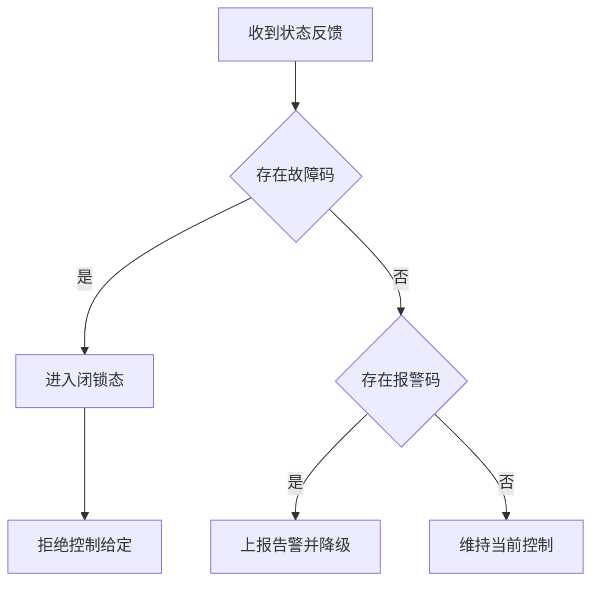

# P1010B 驱动能力边界说明（CAN 首版）

## 0. 核心结论

P1010B 驱动首版采用 `BSP -> CAN 抽象 -> Device -> Motor Vendor` 分层模型。  
驱动层负责协议语义与状态治理，不负责板级寄存器或中断细节。  
首版仅覆盖 CAN 协议全量命令，RS485 仅定义扩展边界，不进入实现范围。

---

## 1. 职责边界


说明：
- `BSP 层`：只提供硬件收发、中断分发、错误中断上报。
- `CAN 抽象层`：提供统一设备收发与过滤资源管理，不暴露板卡差异到上层。
- `Device 层`：统一对象生命周期与调用入口。
- `P1010B 驱动`：实现协议编解码、状态机、故障策略、参数策略。
- `应用层`：只使用设备语义 API，不直接处理协议字节细节。

---

## 2. 稳定承诺（MUST）

1. 统一命令覆盖：支持 `0x32~0x40` 下行及对应上行 `0x50+id~0xB0+id`。
2. 统一量纲语义：
   - `IQ(A) = raw / 100`
   - `Vbus(V) = raw / 10`
   - `Speed(RPM) = raw / 10`
3. 默认安全策略：故障闭锁，报警降级告警。
4. 模式与参数前置条件：文档要求“仅失能态可配置”的参数，驱动必须强校验。
5. 超时与重试策略必须可配置且有默认值。
6. 回调上下文可控，禁止在中断上下文执行重处理逻辑。
7. 参数能力采用“全参数框架 + 关键参数白名单”。

---

## 3. 明确不承诺（UNSPECIFIED）

1. 不承诺公平调度顺序（多任务并发调用时）。
2. 不承诺厂商固件未定义字段的稳定含义。
3. 不承诺跨固件版本的性能指标完全一致。
4. 不承诺首版提供 RS485 运行能力。

---

## 4. 强约束禁止项（MUST NOT）

1. 不得绕过 `Device` 接口直接访问 BSP 私有实现。
2. 不得在驱动公共头文件暴露硬件 filter bank、具体中断号等板级细节。
3. 不得在故障闭锁状态继续下发高风险给定命令。
4. 不得将手册冲突范围硬编码为单一常量，必须保留可配置限幅。
5. 不得在 ISR 回调中执行阻塞等待、动态内存分配、复杂日志 I/O。
6. 不得在多个模块维护同一份协议事实数据。
7. 不得将“报警可恢复”与“故障不可自动恢复”语义混用。

---

## 5. 执行上下文边界

```text
Thread Context:
- 允许阻塞等待
- 允许参数事务
- 允许状态切换与重试

ISR Context:
- 仅允许快速入队或置位通知
- 禁止阻塞
- 禁止复杂协议解析
```

---

## 6. 协议边界与冲突处理规则

1. 协议权威来源：`P1010B_111 电机规格书 V1.2 0924.pdf`。
2. `P1010B电机使用参考_20240514.pdf` 作为示例和联调参考。
3. 若两文档冲突，优先采用规格书；实现上以可配置限幅吸收分歧。
4. 所有“魔数”需集中定义并标注来源章节。

---

## 7. 事件与回调边界

驱动对外事件：
- `on_feedback`：反馈快照更新。
- `on_fault_changed`：故障或报警变化。
- `on_online_changed`：在线状态变化。

回调约束：
- 回调触发不得阻塞 CAN 接收路径。
- 回调参数必须是已解码语义数据，不向应用泄露协议字节包。

---

## 8. 故障与报警责任分界



说明：
- 故障码：默认不可自动恢复，需显式恢复流程。
- 报警码：可恢复，不自动进入闭锁。

---

## 9. 参数管理边界

关键参数白名单（首版默认开放）：

```text
28  工作模式
42  电机 ID
43  通信与波特率
22  总线心跳使能
47  心跳时间
11  故障屏蔽
```

策略说明：
- 框架支持全参数 ID 读写。
- 非白名单参数默认不开放给业务层直接写入。
- 需要扩展时通过白名单评审流程加入。

---

## 10. 审计检查表

1. 分层依赖是否存在反向依赖或越层调用。
2. 公开接口是否泄露板级概念。
3. 故障闭锁是否被任何路径绕开。
4. 失能前置条件是否在参数写入处生效。
5. 命令覆盖是否完整覆盖 `0x32~0x40`。
6. 反馈解码量纲是否严格一致。
7. 回调是否满足线程上下文约束。
8. 冲突规则是否执行“规格书优先 + 可配置限幅”。

