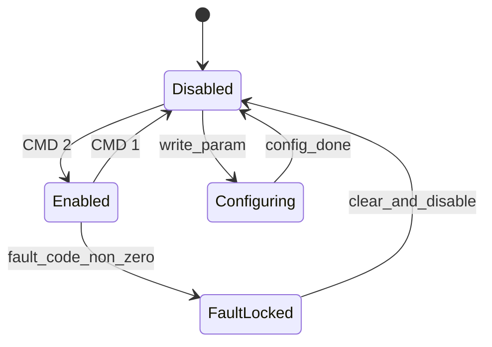
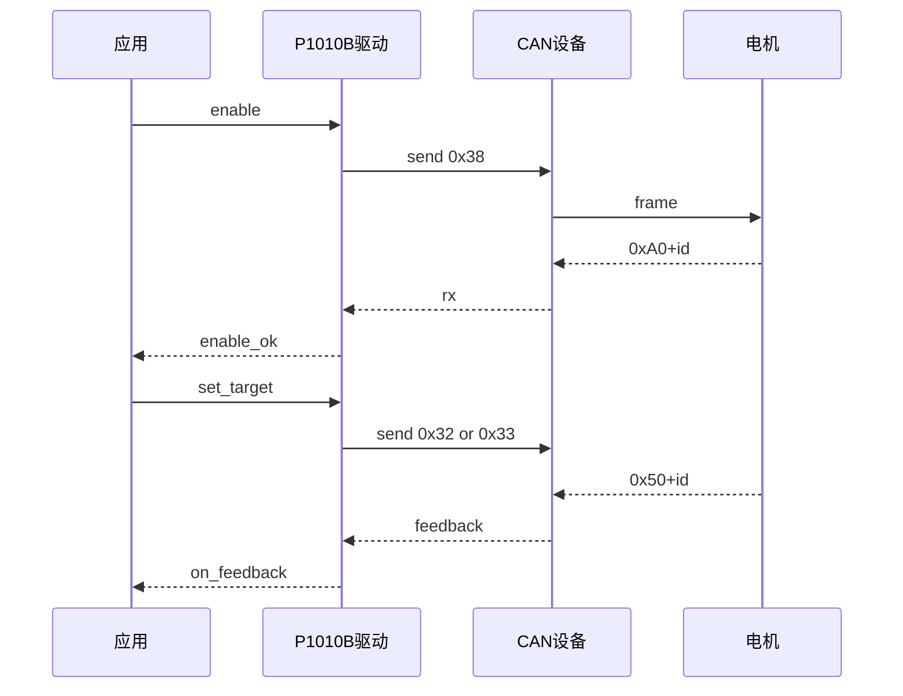
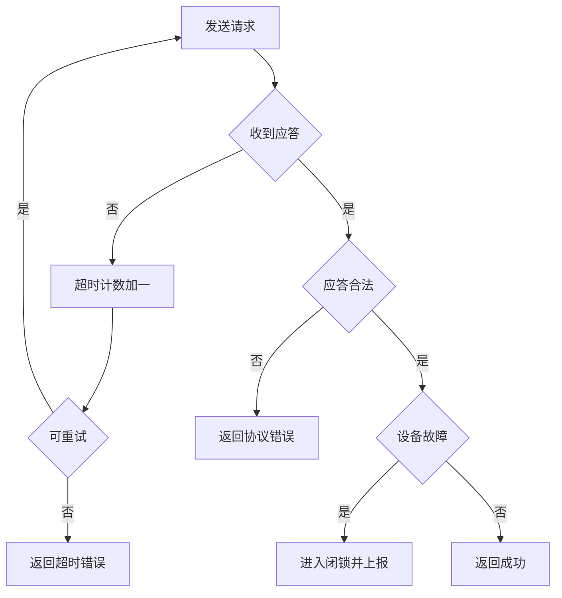

# P1010B 驱动顶层设计指南（CAN 首版）

## 0. 文档目的与范围

本指南定义 P1010B 驱动的顶层架构、接口语义、状态机、错误处理和演进约束。  
本文是设计与实现约束文档，不是 API 手册。

> 分层总依赖矩阵以 `awlf/document/architecture/分层与依赖规范.md` 为唯一规范源，本文仅补充 P1010B 专项约束。

范围：
- 覆盖 CAN 协议 `0x32~0x40` 全量能力。
- 覆盖反馈应答 `0x50+id~0xB0+id` 的解析语义。
- 统一 IQ、母线电压等关键数据语义。

非目标：
- 不包含 RS485 运行实现。
- 不包含上位机工具流程实现。

---

## 1. 设计目标

1. 可移植：不耦合具体板卡。
2. 稳定：协议语义在不同 BSP 下一致。
3. 安全：故障场景可控，默认闭锁。
4. 可扩展：参数和协议能力可增量演进。
5. 可审计：每个关键策略有明确检查点。

---

## 2. 分层架构与依赖方向


依赖规则：
- `P1010B 驱动` 只依赖 `Device` 和 `CAN 抽象` 暴露的稳定接口。
- `P1010B 驱动` 不依赖中断向量、寄存器、滤波 bank 细节。
- 应用层不得直接拼装协议帧。

---

## 3. 协议设计基线

权威来源：
- `P1010B_111 电机规格书 V1.2 0924.pdf`

辅助来源：
- `P1010B电机使用参考_20240514.pdf`

冲突处理：
- 规格书优先。
- 使用参考仅作示例。
- 冲突范围通过“可配置限幅”吸收。

---

## 4. CAN 命令矩阵

```text
下行命令:
0x32 / 0x33  驱动给定
0x34         反馈方式设置
0x35         主动数据查询
0x36         参数设置
0x37         参数读取
0x38         状态控制
0x39         参数保存
0x40         软件复位

上行应答:
0x50 + id    驱动反馈
0x60 + id    反馈方式设置应答
0x70 + id    主动查询应答
0x80 + id    参数设置应答
0x90 + id    参数读取应答
0xA0 + id    状态控制应答
0xB0 + id    参数保存应答
```

---

## 5. 数据语义与换算

### 5.1 给定值换算

```text
电压命令值 = 电压值(V) * 100
电流命令值 = 电流值(A) * 100
速度命令值 = 速度值(RPM) * 10
位置命令值 = 位置值(Cycle) * 100
```

### 5.2 反馈值换算

```text
speed_rpm = raw_speed / 10
iq_ampere = raw_iq / 100
vbus_volt = raw_vbus / 10
absolute_position = raw_abs_pos
```

---

## 6. 核心对象模型

建议对象语义如下：

```c
typedef enum
{
    P1010B_MODE_OPEN_LOOP = 0,
    P1010B_MODE_CURRENT   = 2,
    P1010B_MODE_SPEED     = 3,
    P1010B_MODE_POSITION  = 4
} P1010BMode_e;

typedef struct
{
    float speedRpm;
    float iqAmpere;
    float busVoltage;
    uint16_t absolutePosition;
    uint32_t timestampMs;
} P1010BFeedback_s;

typedef struct
{
    uint16_t faultCode;
    uint16_t alarmCode;
    uint32_t statusBits;
    bool calibrated;
} P1010BFaultState_s;
```

---

## 7. 状态机设计



状态约束：
- 默认上电 `Disabled`。
- `Enabled` 且无故障时才允许持续控制给定。
- `FaultLocked` 状态下拒绝控制命令。
- 仅在 `Disabled` 允许配置受限参数。

---

## 8. 控制时序与反馈时序



---

## 9. 并发模型

并发策略：
1. 控制路径与接收路径解耦。
2. 单电机配置事务串行。
3. 多电机实例并发互不阻塞。
4. 回调与发送路径隔离，避免回调阻塞收发。

上下文约束：

```text
Thread:
- 配置事务
- 阻塞等待应答

ISR:
- 收到帧后快速投递
- 不做复杂解析和阻塞操作
```

---

## 10. 错误处理策略

错误分层：
- 传输类：超时、收发失败、格式错误。
- 协议类：应答不匹配、字段非法。
- 状态类：未使能、故障闭锁、参数前置条件不满足。



默认策略：
- 控制命令：短超时，最多 1 次重试。
- 配置命令：中超时，最多 2 次重试。
- 保存命令：长超时，不自动重试。

---

## 11. 参数管理策略

框架策略：
- 协议层支持全参数 ID 读写能力。
- 业务开放层采用关键参数白名单。

关键参数白名单：

```text
11  故障屏蔽
22  总线心跳使能
28  工作模式
42  电机ID
43  CAN波特率和类型
47  心跳时间
```

约束：
- 文档要求失能态配置的参数，驱动必须检查当前状态。
- 非白名单写入默认拒绝并返回明确错误码。

---

## 12. 配置项设计

建议配置项：

```c
typedef struct
{
    uint8_t motorId;
    uint32_t requestTimeoutMs;
    uint8_t maxRetryCount;
    P1010BMode_e defaultMode;
    bool enableActiveReport;
    uint8_t activeReportPeriodMs;
    int32_t currentLimitRaw;
    int32_t speedLimitRaw;
    int32_t positionLimitRaw;
    int32_t voltageLimitRaw;
} P1010BConfig_s;
```

---

## 13. 可观测性与诊断

驱动应提供：
- 最近一次成功收发时间戳
- 连续超时计数
- 最近故障码和报警码
- 当前状态机状态
- 最近一次拒绝给定原因

---

## 14. RS485 扩展附录（规划）

首版不实现 RS485，但预留扩展位：
- 传输层接口支持可替换链路后端。
- 协议层保留命令语义复用能力。
- CRC8-MAXIM 与 11 字节帧格式作为后续扩展基础。
